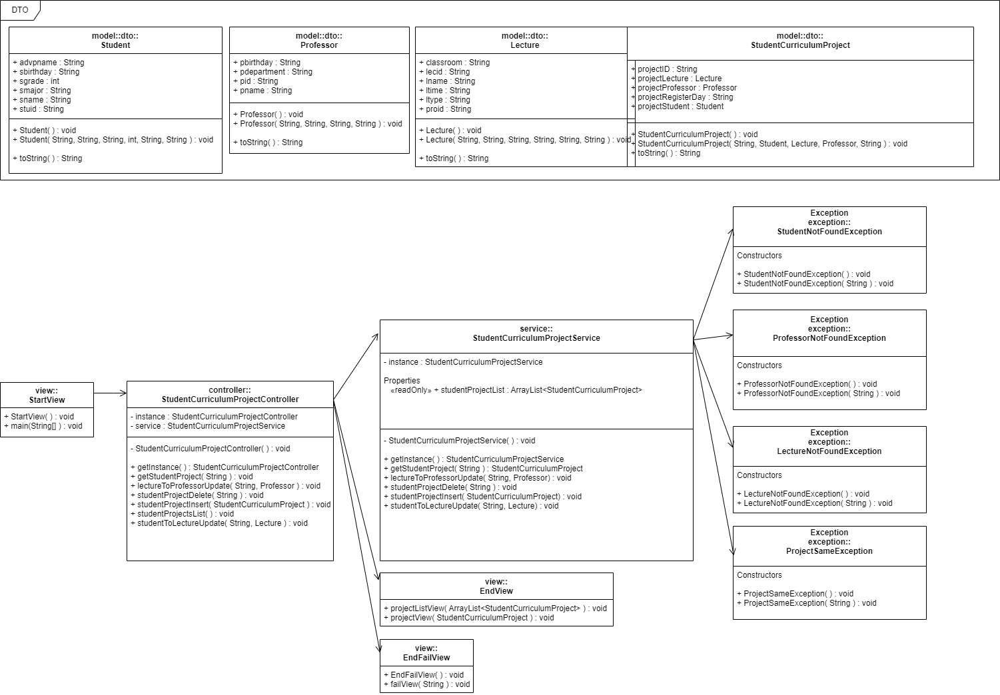

# Java 기반 간단한 수강신청 관리 시스템 구현

## 👨‍👨‍👦‍👦 프로젝트 구성원
- [김민준](https://github.com/mjkim8764)
- [이준석](https://github.com/JSL107)
- [장우재](https://github.com/WoojaeJang)

## 📑 프로젝트 개요
- 해당 프로젝트는 부트캠프에서 자바 기초를 수강후 이를 실습하기 위한 미니프로젝트이다.
- 목표 : 간단한 수강신청 관리 시스템을 구현
- 프로젝트 기간 : 2022-01-14 ~ 2022-01-18

## 🌟 프로젝트 특징
- java를 활용했으며 MVC 패턴을 이용했다.
- 주요 기능으로는 수강신청 정보를 '추가' '조회' '수정' '삭제' 할 수 있다.(CRUD)
- 예외처리를 모두 진행하였다.

## 📊 프로젝트 다이어그램
- 다이어그램은 https://app.diagrams.net/ 에서 작성하였다.

## ❗ 느낀점
- 직접 프로젝트를 하면서 java에 많이 익숙해질 수 있었다.
- CRUD 기능과 MVC 패턴에 익숙해 질 수 있었다.

## 😟 아쉬운점
- 아직 DB연결을 배우지 않아 적용하지 못했다.
- console에서만 진행되기 떄문에 느낌이 안온다.
- 결론 : 아직까지는 숲이 보이지 않는다.
 
